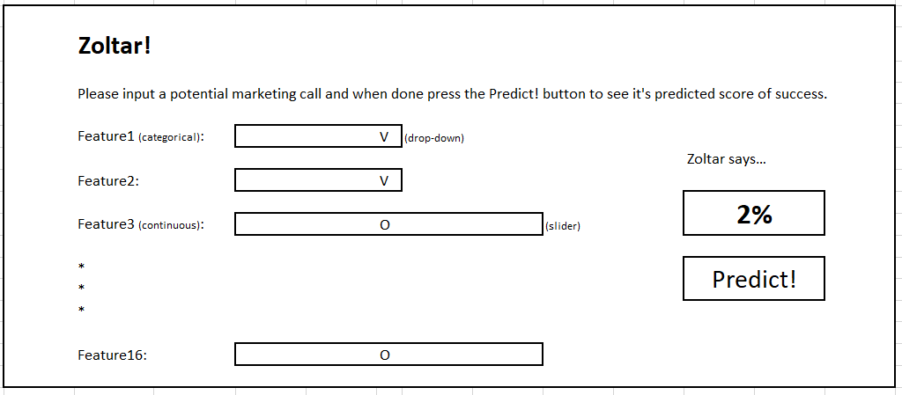

```{r child = "setup.Rmd"}
```

### Welcome

Welcome to Assignment 5!

Remember:

* Only your private Github repository assigned to you by the course admin will be cloned and graded (Submission mode, see instructions [here](https://github.com/DSApps-2023/Class_Slides/blob/master/Apps_of_DS_HW.pdf))
* Like any other University assignment, your work should remain private
* You need to `git clone` your private Github repository locally as explained [here](https://github.com/DSApps-2023/Class_Slides/blob/main/Apps_of_DS_HW.pdf)
* You need to uncomment the starter code inside the chunk, replace the `### YOUR CODE HERE ###`, run the chunk and see that you're getting the expected result
* Pay attention to what you're asked to do and the required output
* For example, using a *different* function than the one you were specifically asked to use, will decrease your score (unless you amaze me)
* You can add other files but do not delete any files
* Commit your work and push to your private Github repository as explained [here](https://github.com/DSApps-2023/Class_Slides/blob/main/Apps_of_DS_HW.pdf)

This assignment is due: 29/5 23:59

### Zoltar!

#### (90 points)

**Notice: This entire section can be done in R (tidymodels + shiny) or Python (sklearn + Dash), it is up to you!**

The `bank_marketing.csv` dataset in your data folder is a real marketing dataset from a Portuguese bank, taken from [Moro et al., 2014](https://www.sciencedirect.com/science/article/abs/pii/S016792361400061X?via%3Dihub). Each row represents a marketing phone call from the bank to its clients, selling them a financial product (deposit in a long term account).

There are 41,188 calls with 16 features and a dependent binary variable `y` in which "yes" means "success, the client made a deposit" and "no" means "failure". The features description can be found in `bank_marketing_features_desc.txt`.

You are the bank's senior data scientist!

Your job is to:

1. Build a proper model to predict for a given new call the probability of success (`y = "yes"`).

2. Build [Zoltar!](https://youtu.be/Q6RK4479XD8), a quick and dirty shiny/Dash app for the bank's center call, which lets the marketing people input the features for a given call, and predict the probability of a successful call (do you know how much money you can save this bank?!)

Model specifics (**30 points**):

* There are missing values in some categorical features, you can treat them as an additional "unknown" category, no need to worry about it.
* You need to try at least gradient boosting trees (`boost_tree()` in tidymodels or `GradientBoostingClassifier()` in sklearn) AND random forest (`rand_forest()` in tidymodels or `RandomForestClassifier()` in sklearn). If you want to try other models you can, no extra credit.
* Notice `tidymodels` has an advantage here because of the ease of using categorical features without additional effort.
* You need to properly choose one of the models based on 20% test data (I'd use AUC).
* You need to show the process in a proper notebook (R or Python) and show the model's performance on the test set (just show the test AUC).
* You should reach an AUC of at least 0.80 (doesn't sound impressive but actually not bad for this type of unbalanced dataset), don't bother with reaching much higher performance.
* You can engineer more features, but this may add complexity when building the app in 2nd phase.
* Once the model is finalized you need to figure out how to save it to later load it in your app. For tidymodels look at `write_rds()` and `read_rds()` (though IRL there are much more impressive tools out there), for sklearn look at [`pickle` or `joblib`](https://scikit-learn.org/stable/model_persistence.html)).

App specifics (**60 points**):

* This is the mockup, very simple, you can change it if you like as long as you do not change the basic functionality below:

* Use drop-down menus for categorical features and sliders for continuous features. Use only valid values, otherwise your model might raise an error and crash the app.
* For each feature there should be a default value (median for continuous features, mode for categorical features)
* The marketing person should be able to choose values for all input features **and only once they press the Predict! button**, will the predicted score appear, nice and clear.
* Bonus 5 points: Dockerize your app! (that is, if I build and run your Dockerfile, your app should be waiting for me in my browser without hassle)
* Bonus 5 points: You are not judged on design! Only functionality. Of course you're welcome to pimp your app, if your design gives me joy you'll get a 5 points bonus.
* If you don't dockerize your app:
  - try not to use weird eccentric uncalled-for libraries, thanks.
  - if shiny: I should be able to run it from Rstudio. If Dash: I should be able to run it with `python app.py` from command line.
* At any case, I will input your apps with a few potential calls, and an app crash decreases 5 points of the score.

Make the bank money!

### Paper questions

##### (10 points)

Read Traag et. al. [Leiden](https://arxiv.org/abs/1810.08473) 2020 paper first 5 pages (of course you're invited to read the whole thing!).

In your own up to 100 words, what are the *two* main modifications of the Louvain method implemented in the Leiden method, and how do they improve Louvain's results?

```{r}
### YOUR ANSWER HERE ###
```


### Wrap up

And that's it, you have built a tree-based ensemble model for classification on a real dataset and a data app for anyone to test it.  Good luck with the rest of the course!